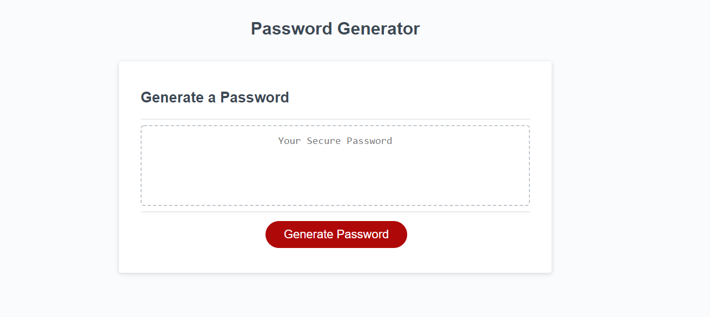

# Homework3PasswordGenerator

#### This password generator was built using HTML, CSS, and JavaScript.
#### The User is required to input a desired password length between 8 and 128
#### The User is required to specify whether they want the password to include lowercase, uppercase, and / or special characters.

[Link to Project](https://jaredc71.github.io/Homework3PasswordGenerator/)